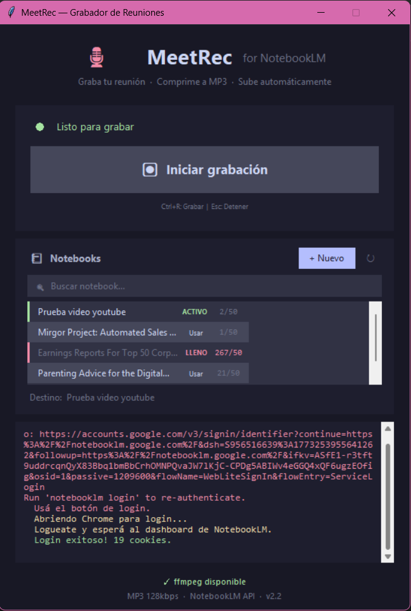

# MeetRec — Meeting Recorder for NotebookLM

Standalone desktop application that records meetings (microphone + speaker),
compresses audio to MP3, and automatically uploads to Google NotebookLM.

<p align="center">
  
</p>

## Features

- **Dual audio capture**: Records microphone and speaker output simultaneously
- **Audio compression**: WAV → MP3 128kbps via ffmpeg (~90% size reduction)
- **NotebookLM integration**: Automatic upload via `notebooklm-py`
- **Google authentication**: Chrome-based login with persistent cookies
- **Cross-platform**: Windows 10+ and Linux (Ubuntu 20.04+)
- **Modern UI**: tkinter GUI with Catppuccin Mocha theme

## System Requirements

- **Python 3.8+** (for building from source)
- **Google Chrome** installed (for authentication)
- **ffmpeg** installed or available in PATH

## Build from Source

### Linux (Ubuntu 20.04+ / Debian 11+)

The build script automatically installs all system dependencies (requires `sudo`):

```bash
git clone https://github.com/<your-org>/MeetRecorder.git
cd MeetRecorder
chmod +x build_linux.sh
./build_linux.sh
```

The script handles:
1. Python 3.8+ verification
2. System packages installation (`python3-venv`, `python3-dev`, `python3-tk`, `libpulse-dev`, `libasound2-dev`, `libsndfile1-dev`, `ffmpeg`, `build-essential`)
3. Virtual environment creation and Python dependencies
4. Chromium browser installation via Playwright
5. PyInstaller executable generation

Output: `dist/MeetRec/MeetRec`

### Windows

```batch
git clone https://github.com/<your-org>/MeetRecorder.git
cd MeetRecorder
build_windows.bat
```

Output: `dist\MeetRec\MeetRec.exe`

## Usage

1. Run `MeetRec` (Linux) or `MeetRec.exe` (Windows)
2. First time: click **"Sign in to Google"**
   - Chrome opens — log in with a Google account that has access to NotebookLM
   - Cookies are saved to `~/.meetrec/storage_state.json`
3. Click **"Start recording"**
4. When finished, click **"Stop recording"**
   - Audio is compressed to MP3
   - Automatically uploaded to the active notebook in NotebookLM

## Project Structure

```
MeetRecorder/
├── src/
│   ├── __init__.py          # Package marker
│   ├── app.py               # Entry point
│   ├── config.py            # Constants, paths, color palette
│   ├── state.py             # Persistent state management
│   ├── ffmpeg_utils.py      # FFmpeg detection and MP3 conversion
│   ├── audio.py             # Audio recording and post-processing
│   ├── notebooklm_client.py # NotebookLM API integration
│   ├── auth.py              # Google authentication (Chrome CDP)
│   └── gui.py               # tkinter GUI (App class)
├── assets/
│   └── screenshot.png       # App screenshot
├── meetrec.spec             # PyInstaller configuration
├── build_linux.sh           # Linux build script (Ubuntu/Debian)
├── build_windows.bat        # Windows build script
├── requirements.txt         # Python dependencies (pinned)
├── LICENSE                  # MIT License
└── README.md
```

## User Data

All user data is stored in `~/.meetrec/`:

| File | Description |
|------|-------------|
| `storage_state.json` | Google authentication cookies |
| `notebooklm_state.json` | Active notebook state |
| `reunion_*.mp3` | Compressed recordings |
| `temp_chrome_profile/` | Temporary Chrome profile for login |

## Technical Notes

- **Audio**: Simultaneous microphone + speaker loopback capture via `soundcard`
- **Compression**: WAV → MP3 128kbps mono via ffmpeg
- **API**: `notebooklm-py` for NotebookLM communication
- **Auth**: Chrome remote debugging (CDP) to extract Google session cookies
- **GUI**: tkinter with Catppuccin Mocha theme

## License

MIT License — see [LICENSE](LICENSE) for details.
